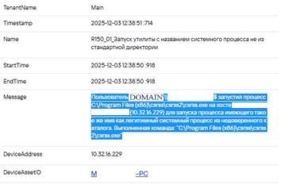
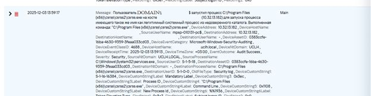
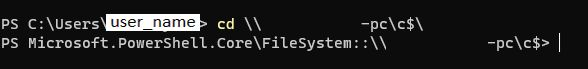
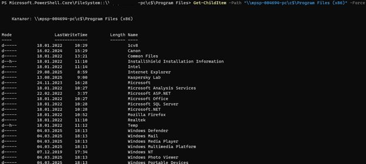
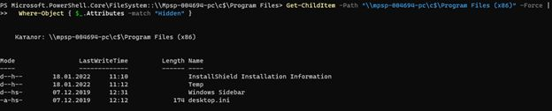
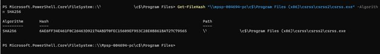
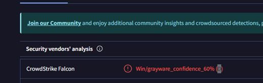

# T1036 Masquerading — разбор инцидента с csrss.exe

## 🧾 Карточка инцидента

| Поле                    | Значение |
|-------------------------|---------|
| Идентификатор           | T1036_Masquerading_csrss |
| Дата / время обнаружения| *указать по данным KUMA* |
| Источник обнаружения    | SIEM KUMA (корреляционное правило по Masquerading) |
| Затронутая система      | Рабочая станция `host_name` (Windows, домен `DOMAIN`) |
| IP-адрес                | `указать IP` |
| MITRE ATT&CK            | T1036 — Masquerading |
| Категория               | Подмена системного процесса (`csrss.exe`) |
| Критичность             | Высокая (подмена критического системного процесса) |
| Статус                  | Требует верификации: возможный компонент DLP SearchInform |
| Ответственный           | Руководитель службы ИБ / SOC-аналитик 2–3 линии |
| Краткое резюме          | На рабочей станции обнаружен исполняемый файл `csrss.exe` в каталоге `Program Files (x86)`, подписанный SearchInform OOO. Необходимо отличить штатный компонент DLP от подмены системного процесса и при отсутствии подтверждения вендора рассматривать файл как Masquerading. |

---

## 1. Структура репозитория

```text
T1036_Masquerading/
 ├── README.md                 # Глобальный гайд по инциденту
 ├── docs/
 │    ├── README.md            # Описание документов
 │    └── T1036_Masquerading(csrss).docx
 ├── pics/
 │    ├── README.md            # Описание скриншотов
 │    ├── `01_SIEM.jpg`
 │    ├── `02_SIEM.jpg`
 │    ├── `03_PS.jpg`
 │    ├── `04_PS.jpg`
 │    ├── `05_PS.jpg`
 │    ├── `06_PS.jpg`
 │    ├── `07_Virus_total.jpg`
 │    ├── `08_PS.jpg`
 │    └── `09_PS.jpg`
 └── scripts/
      └── README.md            # Набор команд и заготовок скриптов PowerShell
```

---

## 2. Контекст: что такое csrss.exe и почему это критично

`csrss.exe` (Client/Server Runtime Subsystem) — системный компонент Windows, обеспечивающий пользовательскую часть Win32‑подсистемы: управление процессами и потоками, консольными окнами, корректное завершение сессии и другие критические функции ОС.

Ключевые свойства:

- располагается строго в каталоге `%SystemRoot%\System32\csrss.exe` (обычно `C:\Windows\System32\csrss.exe`);
- относится к *critical processes* — завершение приводит к краху системы;
- запускается по одному экземпляру на сессию.

Поэтому **любое появление исполняемого файла с именем `csrss.exe` вне `System32` должно рассматриваться как подозрительное** (подмена / Masquerading).

---

## 3. Техника MITRE T1036 Masquerading

В терминах MITRE ATT&CK Masquerading (T1036) — это изменение имени, пути или метаданных файла / службы / задачи для того, чтобы артефакт выглядел легитимным и уходил от детектирования. Типичные примеры:

- использование имени известного системного процесса (`svchost.exe`, `lsass.exe`, `csrss.exe`);
- размещение исполняемого файла в каталоге, похожем на легитимный (`C:\Windows\System32 ` → `C:\Windows\System32 \` с пробелом, и т.п.);
- переименование вредоносного сервиса под существующий легитимный.

В нашем случае имя **легитимного системного процесса** используется для файла, размещённого в каталоге `C:\Program Files (x86)\csrss\csrss2\`, что соответствует технике **T1036.005 — Match Legitimate Name or Location**.

---

## 4. Описание события в SIEM (этап «Обнаружение»)

**Источник:** корреляционное правило KUMA по Masquerading системных процессов.  

**Сработавший алерт (упрощённо):**

> Пользователь `DOMAIN\host_name$` запустил процесс  
> `C:\Program Files (x86)\csrss\csrss2\csrss.exe`  
> на хосте `host_name.DOMAIN (10.32.16.229)` для запуска процесса, имеющего такое же имя, как легитимный системный процесс, из недоверенного каталога.  

Скриншоты в каталоге `pics/`:

- ``01_SIEM.jpg`  — карточка алерта;

[](./pics/01_SIEM.jpg)
` 
- ``02_SIEM.jpg` — детализация события и цепочки процессов.

[](./pics/02_SIEM.jpg)
` 

Аналитик фиксирует:

1. Используется имя `csrss.exe`.
2. Путь не совпадает с `C:\Windows\System32\csrss.exe`.
3. Инициатор — учётная запись компьютера `host_name$`, что часто указывает на запуск из службы, планировщика задач, GPO-скрипта или системного агента.

---

## 5. Пошаговый разбор (этап «Анализ»)

### 5.1. Подключение к файловой системе хоста

Выполняется подключение по административному ресурсу:

```powershell
cd \\host_name\c$\
```

Далее — анализ содержимого `Program Files (x86)` с учётом скрытых и системных атрибутов:

```powershell
Get-ChildItem -Path "\\host_name\c$\Program Files (x86)" -Force
```

Если директория `csrss` не видна из‑за атрибутов, используется фильтрация:

```powershell
Get-ChildItem -Path "\\host_name\c$\Program Files (x86)" -Force |
    Where-Object { $_.Attributes -match "Hidden" }
```

Скриншоты хода проверки находятся в ``./pics`

[](./pics/03_PS.jpg)


[](./pics/04_PS.jpg)


[](./pics/05_PS.jpg)


[](./pics/06_PS.jpg)


**Вывод:** скрытый каталог `csrss` существует, но недоступен для простой навигации, что дополнительно указывает на попытку маскировки.

---

### 5.2. Получение криптографического хэша файла

Для однозначной идентификации исполняемого файла используется `Get-FileHash`:

```powershell
Get-FileHash "\\host_name\c$\Program Files (x86)\csrss\csrss2\csrss.exe" -Algorithm SHA256
```

Результат:

```text
SHA256  6AE6FF34E461F0C26463D92174ABD70FEC15609EF953C28E0B861BA727C79565
```

Далее хэш отправляется на анализ в сервис VirusTotal.

Ссылка на сервис: <https://www.virustotal.com/>

---

### 5.3. VirusTotal: классификация как Grayware

По результатам VirusTotal (скриншот ``07_Virus_total.jpg`

[](./pics/07_Virus_total.jpg)
`):

- Платформа: Windows;
- Тип угрозы: **Grayware** (потенциально нежелательное ПО);
- Уверенность детекции CrowdStrike: ~60%;
- Статус: Detected (обнаружено, но может не блокироваться по умолчанию).

Это уже достаточное основание для продолжения расследования, но не доказывает 100% вредоносность — требуется контекст.

---

### 5.4. Анализ цифровой подписи файла

Проверка подписи:

```powershell
Get-AuthenticodeSignature "\\host_name\c$\Program Files (x86)\csrss\csrss2\csrss.exe"
```

Файл имеет валидную подпись, отпечаток:

```text
Thumbprint: C4741CB7370E7BBCD6B520C97F9BAC1367476900
Status    : Valid
Signer    : Searchinform OOO
```

Важно: **валидная подпись НЕ делает файл безопасным**, но добавляет контекст:

- сертификат действительно выдан компании SearchInform OOO;
- SearchInform — известный вендор DLP/мониторинга;
- в инфраструктуре компании развёрнута DLP SearchInform.

---

### 5.5. Извлечение параметров сертификата

Полная информация о сертификате:

```powershell
(Get-AuthenticodeSignature "\\host_name\c$\Program Files (x86)\csrss\csrss2\csrss.exe").SignerCertificate |
    Format-List *
```

Ключевые поля:

- Subject: `CN=Searchinform OOO, O=Searchinform OOO, ...`
- Issuer: `CN=GlobalSign GCC R45 EV CodeSigning CA 2020, O=GlobalSign nv-sa, C=BE`
- EnhancedKeyUsage: Code Signing
- Период действия: 21.02.2025–06.05.2028

---

## 6. Углублённый анализ и возможные сценарии

### 6.1. Почему это именно Masquerading

1. Имя файла совпадает с критическим системным процессом `csrss.exe`.
2. Путь установки отличается от стандартного `C:\Windows\System32\csrss.exe`.
3. Каталог скрыт специальными атрибутами.
4. Файл классифицирован как Grayware.
5. Подпись выдана не Microsoft, а сторонней компанией.

Это полностью укладывается в технику **Masquerading (T1036)**: злоумышленник (или производитель ПО) использует имя системного процесса для снижения подозрительности в глазах пользователя и средств защиты.

### 6.2. Вероятные сценарии

**Сценарий A — штатный компонент DLP SearchInform**

- Вендор SearchInform поставляет модуль, выполняющий функции мониторинга / контроля, который:
  - подписан их сертификатом;
  - устанавливается в собственный каталог (`Program Files (x86)\csrss\...`);
  - переименован в `csrss.exe` (возможно, намеренно для маскировки).

Риски:

- подмена имени core‑процесса создаёт зону недоверия к продукту;
- усложняет расследования ИБ;
- может приводить к ложным срабатываниям и конфликтам с другими средствами защиты.

**Сценарий B — злоумышленник использует сертификат SearchInform**

- ключ подписи SearchInform скомпрометирован (или злоумышленник получил доступ к подписьному сервису);
- вредонос подписан легитимным сертификатом, чтобы повысить доверие со стороны AV/EDR;
- имя `csrss.exe` выбрано для маскировки под системный процесс.

В этом случае инцидент уже выходит на уровень **компрометации поставщика**.

**Сценарий C — стороннее ПО ошибочно использует имя csrss.exe**

- разработчик компонента (в т.ч. DLP) намеренно или по ошибке выбрал имя `csrss.exe` «чтобы не пугать пользователя»;
- при этом функционал не вредоносен, но нарушает лучшие практики ИБ.

---

## 7. Решение: дерево принятия решений

1. **Есть ли официальная документация SearchInform, подтверждающая использование файла `csrss.exe` в таком пути?**
   - Да → перейти к п.2.
   - Нет → запросить вендору тикет с вопросами:
     - Используете ли вы файл `csrss.exe` вне System32?
     - Каково назначение модуля по пути `C:\Program Files (x86)\csrss\csrss2\csrss.exe`?
     - Соответствует ли хэш `6AE6FF34...727C79565` официальной сборке?

2. **Вендор подтверждает, что это штатный компонент:**

   - сверить хэш и версию файла с эталонной;
   - убедиться, что:
     - файл присутствует на всех рабочих станциях с DLP;
     - его путь и поведение совпадают;
   - при полном совпадении:
     - задокументировать решение ИБ;
     - добавить **точечное исключение** по хэшу / подписи в:
       - SIEM (уменьшение шума);
       - антивирус / EDR;
     - оставить дополнительные контроли (например, триггер на запуск из нестандартных путей, отличных от эталонного).

3. **Вендор НЕ подтверждает, хэш не совпадает или ответ отсутствует:**

   - рассматривать файл как подмену системного процесса (Masquerading);
   - поднимать критичность инцидента до High / Critical;
   - запускать процедуру реагирования (см. следующий раздел).

---

## 8. Реагирование при сценарии «это не DLP»

Если по результатам верификации выявлено, что файл не является штатным компонентом SearchInform:

1. **Изоляция хоста**
   - отключить от сети;
   - запретить удалённые сессии;
   - перевести в режим форензики.

2. **Сбор артефактов**
   - сохранить файл и весь каталог `csrss` (в т.ч. скрытые файлы);
   - снять дамп памяти (по ситуации);
   - выгрузить журналы:
     - Windows Security / System / Application;
     - Sysmon (если есть);
     - журналы антивируса и EDR;
     - события KUMA за период активности.

3. **Анализ persistence**
   - автозагрузка:
     ```powershell
     Get-CimInstance Win32_StartupCommand
     ```
   - планировщик задач:
     ```powershell
     schtasks /query /fo LIST /v
     ```
   - службы:
     ```powershell
     Get-Service | Where-Object { $_.Name -like "*csrss*" }
     ```
   - GPO‑скрипты входа/выхода пользователей и компьютеров.

4. **Распространение**
   - поиск по инфраструктуре по хэшу и имени файла;
   - сканирование уязвимых хостов;
   - построение временной шкалы: когда появился файл, кем был создан, откуда загрузился.

5. **Устранение**
   - удаление файла и связанной persistence;
   - контроль повторного появления (HIDS / EDR‑правило по пути и хэшу);
   - обновление корреляционных правил SIEM.

6. **Уроки и улучшения**
   - формализация playbook для Masquerading системных процессов;
   - добавление в baseline контроля по критическим процессам;
   - проведение обучения ИТ/ИБ по индикациям подмены системных процессов.

---

## 9. Индикаторы компрометации (IOC)

- **Путь файла:** `C:\Program Files (x86)\csrss\csrss2\csrss.exe`
- **Имя файла:** `csrss.exe`
- **SHA256:** `6AE6FF34E461F0C26463D92174ABD70FEC15609EF953C28E0B861BA727C79565`
- **Подписант:** `Searchinform OOO`
- **Отпечаток сертификата:** `C4741CB7370E7BBCD6B520C97F9BAC1367476900`

---

## 10. Набор команд / скриптов из расследования

Эти команды также продублированы в файле `scripts/README.md`.

```powershell
# 1. Переход на диск C: удалённого хоста по административному ресурсу
cd \\host_name\c$\

# 2. Просмотр содержимого Program Files (x86) с учётом скрытых каталогов
Get-ChildItem -Path "\\host_name\c$\Program Files (x86)" -Force

# 3. Просмотр только скрытых элементов
Get-ChildItem -Path "\\host_name\c$\Program Files (x86)" -Force |
    Where-Object { $_.Attributes -match "Hidden" }

# 4. Получение SHA256‑хэша подозрительного файла
Get-FileHash "\\host_name\c$\Program Files (x86)\csrss\csrss2\csrss.exe" -Algorithm SHA256

# 5. Проверка цифровой подписи файла
Get-AuthenticodeSignature "\\host_name\c$\Program Files (x86)\csrss\csrss2\csrss.exe"

# 6. Получение полной информации о сертификате
(Get-AuthenticodeSignature "\\host_name\c$\Program Files (x86)\csrss\csrss2\csrss.exe").SignerCertificate |
    Format-List *
```

---

## 11. Полезные внешние ссылки

- MITRE ATT&CK T1036 Masquerading (EN): <https://attack.mitre.org/techniques/T1036/>
- MITRE ATT&CK T1036 (RU‑адаптация PT Expert): <https://mitre.ptsecurity.com/en-US/T1036>
- Маскировка (Masquerading) — обзор техники: <https://d3fend.mitre.org/offensive-technique/attack/T1036/>
- Описание Client/Server Runtime Subsystem (`csrss.exe`):  
  - Wikipedia: <https://en.wikipedia.org/wiki/Client/Server_Runtime_Subsystem>
  - Обзор процесса csrss.exe: <https://www.ionos.com/digitalguide/server/know-how/csrssexe/>
- DLP SearchInform (официальный сайт):  
  - Продукт SearchInform DLP: <https://searchinform.com/products/searchinform-dlp/>
  - О компании SearchInform: <https://searchinform.com/>
- PowerShell:  
  - `Get-FileHash`: <https://learn.microsoft.com/en-us/powershell/module/microsoft.powershell.utility/get-filehash>  
  - `Get-AuthenticodeSignature`: <https://learn.microsoft.com/en-us/powershell/module/microsoft.powershell.security/get-authenticodesignature>
- VirusTotal (онлайн‑анализ бинарных файлов и URL): <https://www.virustotal.com/>

---

## 12. Как использовать этот репозиторий

- **Инженеры ИБ / SOC‑аналитики**  
  Используют `README.md` как пошаговый гайд по разбору аналогичных инцидентов Masquerading.

- **Аудиторы и руководители ИБ**  
  Используют структуру `docs/` и `pics/` как доказательную базу (evidence pack) по конкретному кейсу.

- **Разработчики правил SIEM и EDR**  
  Используют разделы «IOC» и «Реагирование» для создания корреляций и детект‑правил.

