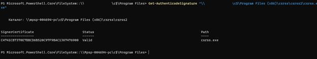
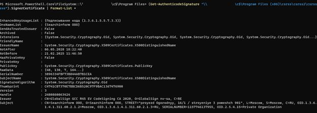

# T1036 Masquerading Incident Response Guide

## Репозиторий структуры
```
T1036_Masquerading/
 ├── docs/
 │    └── T1036_Masquerading(csrss).docx
 ├── pics/
 │    ├── 01_SIEM.jpg
 │    ├── 02_SIEM.jpg
 │    ├── 03_PS.jpg
 │    ├── 04_PS.jpg
 │    ├── 05_PS.jpg
 │    ├── 06_PS.jpg
 │    ├── 07_Virus_total.jpg
 │    ├── 08_PS.jpg
 │    └── 09_PS.jpg
 └── scripts/
```

## 1. Описание инцидента
Анализ основан на документе **docs/T1036_Masquerading(csrss).docx**.

KUMA зафиксировала запуск:
```
C:\Program Files (x86)\csrss\csrss2\csrss.exe
```
что соответствует MITRE **T1036 Masquerading**.


## 2. Проверка наличия файла
```powershell
cd \\host_name\c$\
Get-ChildItem -Path "\\host_name\c$\Program Files (x86)" -Force
```


Если скрытые:
```powershell
Get-ChildItem -Path "\\host_name\c$\Program Files (x86)" -Force |
    Where-Object { $_.Attributes -match "Hidden" }
```

## 3. Извлечение хэша файла
```powershell
Get-FileHash "\\host_name\c$\Program Files (x86)\csrss\csrss2\csrss.exe" -Algorithm SHA256
```


Хэш:
```
6AE6FF34E461F0C26463D92174ABD70FEC15609EF953C28E0B861BA727C79565
```

## 4. VirusTotal


Результат: Grayware / Suspicious.

## 5. Проверка подписи
```powershell
Get-AuthenticodeSignature "...\csrss.exe"
```



Обнаружено:
- Подписано **SearchInform OOO**
- Оригинальный csrss.exe — только Microsoft.

## 6. Проверка сертификата
```powershell
(Get-AuthenticodeSignature "...").SignerCertificate | Format-List *
```



## 7. Вывод
- Да, это **Masquerading**.
- Требует проверки.
- В инфраструктуре установлена **SearchInform DLP**.
- Файл **НЕ должен использовать имя csrss.exe**, даже если это компонент DLP.
- Требуется запрос в SearchInform.

## 8. Рекомендации
### Если файл — компонент SearchInform:
- Запросить официальное подтверждение вендора.
- Проверить наличие аналогичного файла на других станциях.
- Если подтверждено — внести **исключение по хэшу**, не по пути.

### Если файл НЕ принадлежит DLP:
- Изолировать хост.
- Сохранить артефакты.
- Проверить autostart, tasks, services.
- Провести сканирование AV/EDR.

## 9. Скрипты из документа
```powershell
cd \\host_name\c$\

Get-ChildItem -Path "\\host_name\c$\Program Files (x86)" -Force

Get-ChildItem -Path "\\host_name\c$\Program Files (x86)" -Force |
    Where-Object { $_.Attributes -match "Hidden" }

Get-FileHash "\\host_name\c$\Program Files (x86)\csrss\csrss2\csrss.exe" -Algorithm SHA256

Get-AuthenticodeSignature "\\host_name\c$\Program Files (x86)\csrss\csrss2\csrss.exe"

(Get-AuthenticodeSignature "\\host_name\c$\Program Files (x86)\csrss\csrss2\csrss.exe").SignerCertificate | Format-List *
```

