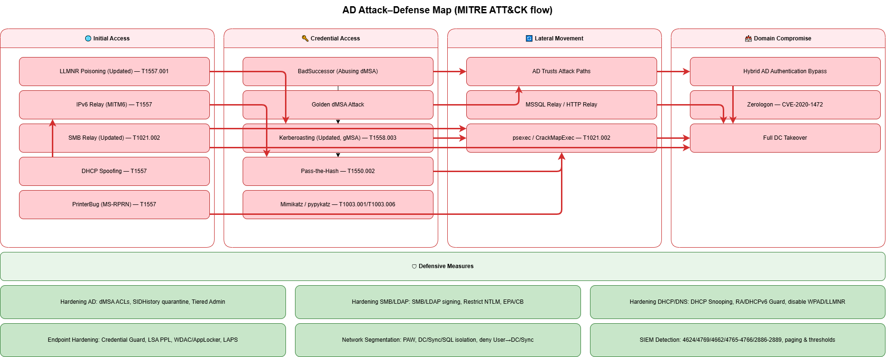
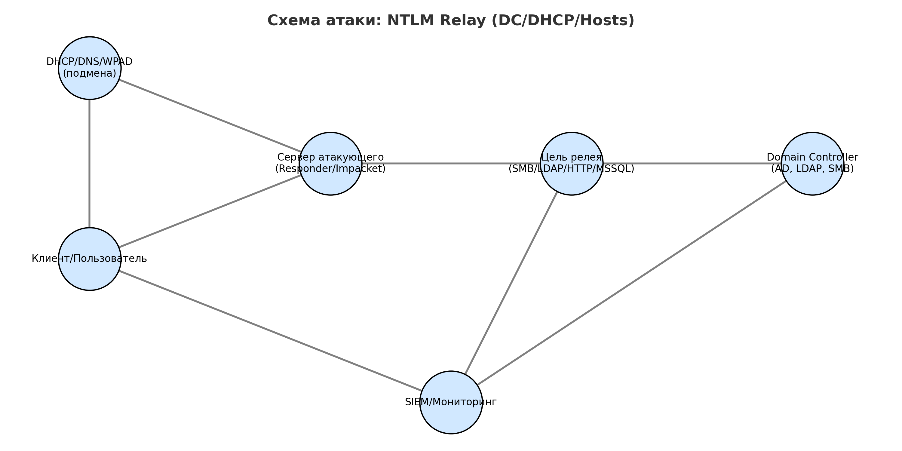

# Protection Guides — Комплексные меры защиты AD и сетевой инфраструктуры

Данный раздел репозитория содержит практические материалы по защите инфраструктуры Active Directory от актуальных техник атак (включая NTLM Relay, релей SMB/LDAP/HTTP, атаки на Kerberos, dMSA/gMSA, Zerologon и др.), а также рекомендации по мониторингу и выявлению подобных действий с помощью SIEM.

---

## 📌 Схема атаки

[Источник схемы (.drawio)](./scheme/ad_attack_defense_map.drawio)

---

## 📂 Структура

### 📁 Чек-лист
- [NTLM_Relay_Checklist.md](./checklist/NTLM_Relay_Checklist.md) — пошаговый чек-лист по защите от NTLM Relay.

### 📁 Схема
- [NTLM_Relay_Scheme.png](./scheme/NTLM_Relay_Scheme.png) — наглядная схема атаки NTLM Relay.
- [NTLM_Relay_Scheme_source.drawio](./scheme/NTLM_Relay_Scheme_source.drawio) — исходник схемы для редактирования в draw.io/diagrams.net.

### 📁 SIEM
- [SIEM_monitoring_recommendations.md](./siem/SIEM_monitoring_recommendations.md) — рекомендации по настройке правил корреляции и мониторингу.
- [ссылка SIEM Wazuh (private)](https://github.com/vit81g/SIEM-Wazuh) — рекомендации по архитектуре, установке и настройке правил корреляции.

### 📁 Инструменты
- [Ссылка (private)](https://github.com/vit81g/Attack_AD/tree/main) на репозиторий c инструментами и реализацит атак.

### 📁 Реализация атак
- [Ссылка (private)](https://github.com/vit81g/Attack_AD/tree/main) на репозиторий c инструментами и реализацит атак.

### 📁 Защита
- [AD Hardening](./protection/hardening-active-directory.md) — усиление безопасности Active Directory.
- [SMB/LDAP Hardening](./protection/hardening-smb-ldap.md) — защита SMB и LDAP.
- [DHCP/DNS Security](./protection/hardening-dhcp-dns.md) — защита служб DHCP и DNS.
- [Endpoint Hardening](./protection/hardening-endpoints.md) — защита конечных точек.
- [Network Segmentation](./protection/network-segmentation.md) — сегментация сети.

### 📁 playbooks
- [General Incident Response](./playbooks/general-incident-response.md) — общий план реагирования на инциденты ИБ.
- [NTLM Relay Response](./playbooks/ntlm-relay-response.md) — реагирование на атаку NTLM Relay.
- [AD dMSA Compromise](./playbooks/playbook-ad-dmsa-compromise.md) — реагирование на компрометацию dMSA.
- [AD Trusts Abuse](./playbooks/playbook-ad-trusts-abuse.md) — реагирование на злоупотребление trust-отношениями AD.
- [Hybrid AD Bypass](./playbooks/playbook-hybrid-ad-bypass.md) — реагирование на обход аутентификации в гибридном AD.
- [Kerberoasting gMSA](./playbooks/playbook-kerberoasting-gmsa.md) — реагирование на атаку Kerberoasting против gMSA.
- [NTLM Relay](./playbooks/playbook-ntlm-relay.md) — план реагирования на NTLM Relay (детализированный).

---

## 🎯 Цели
- Повысить осведомлённость команды ИБ о векторах атак на основе NTLM Relay и смежных техник.
- Сформировать набор правил для SIEM под инфраструктуру организации.

## 🛡 Рекомендуемое применение
1. Использовать [NTLM_Relay_Checklist.md](./checklist/NTLM_Relay_Checklist.md) для аудита.
2. Внедрить правила из [siem](./siem) в боевую SIEM.

## 📜 Лицензия
Материалы предоставляются для учебных и тестовых целей. Использование в продуктивной среде — на усмотрение владельца инфраструктуры.